# FedProt

Privacy-Preserving Federated Differential Protein Expression Analysis tool.

It is a federated version of state of the art [DEqMS](https://pubmed.ncbi.nlm.nih.gov/32205417/) workflow. 

Current implementaion is available for DIA MS data.

## Config 

```
fedprot:
  counts: protein_counts.tsv
  design: design.tsv
  intensities: protein_groups_matrix.tsv
  sep: '\t'
  
  use_smpc: true
  
  max_na_rate: 0.8
  log_transformed: false

    # label: "Condition"
  target_classes: [...] 
  covariates: []

  result_table: "DPE.csv"
```

## Running app
You can run FedProt as a standalone app in the FeatureCloud test-bed. You can also run the app using CLI:

```
featurecloud test start --app-image featurecloud.ai/fedprot --client-dirs './c1,./c2,./c3' --generic-dir './generic'
```

# Structure

```mermaid 
stateDiagram-v2
    direction LR
    [*] --> initial
    state "Initial Processing" as IP {
        initial --> common_proteins: coordinator
        common_proteins --> validation
        initial --> validation: participant
        validation --> prot_na_counting
    }
    state "Data Filtering" as PCF {
        
        prot_na_counting --> prot_na_filtering
        prot_na_filtering --> compute_XtY_XtX
        prot_na_counting --> compute_XtY_XtX
    }
    state "Federated Linear Regression" as Comp {        
        compute_XtY_XtX --> compute_beta
        compute_beta --> compute_SSE
        compute_XtY_XtX --> compute_SSE
        compute_SSE --> aggregate_SSE
    }
    state "Ftting Contrasts" as FS {
        aggregate_SSE --> make_contrasts
        make_contrasts --> fit_contasts
        fit_contasts --> ebayes
        ebayes --> get_counts
    }

    compute_SSE --> get_counts
    
    state "Applying counts" as AC {    
        get_counts --> aggregate_counts
        aggregate_counts --> spectral_count_ebayes
        spectral_count_ebayes --> write_results
        get_counts --> write_results
    }
    write_results --> [*]


```



# Publication
...