# FedProt

Privacy-Preserving Federated Multi-center Differential Protein Abundance Analysis tool.

It is a federated version of state of the art [DEqMS](https://pubmed.ncbi.nlm.nih.gov/32205417/) workflow. 

Current implementaion is available for DIA-LFQ and DDA-TMT MS data, as well as for any other data type that does not require additional preprocessing.

## Config Settings 

Here is an example config file. Optional parameters are marked.  
In data folder you can find example structure of client's data and config files.

```
fedprot:
  counts: protein_counts.tsv
  design: design.tsv
  intensities: protein_groups_matrix.tsv
  sep: '\t'
  
  use_smpc: true
  
  max_na_rate: 0.8
  log_transformed: false

  experiment_type: 'TMT'            # optional, default is "DIA"
  ref_type: 'in_silico_reference'   # optional, only if "TMT" specified
  plex_covariate: true              # optional, only if "TMT" specified
  plex_column: "Pool"               # optional, only if "TMT" specified

  use_median: true                  # default - false
  use_irs: true                     # default - false
  
  remove_single_pep_protein: true   # default - false
  
  use_counts: true
  only_shared_proteins: false

  target_classes: [...]             # example - ["heathy", "FSGS"]
  covariates: []

  result_table: "DPE.csv"
```


## Running the app

### Prerequisite

To run FedProt app, Docker and FeatureCloud pip package should be installed:

```shell
pip install featurecloud
```

Download or build locally the app:

```shell
# download
featurecloud app download featurecloud.ai/fedprot

# OR build
featurecloud app build featurecloud.ai/fedprot
```

### Run

You can run FedProt as a standalone app in the FeatureCloud test-bed [FeatureCloud test-bed](https://featurecloud.ai/development/test), or you can also run the app using CLI:

```
featurecloud test start --app-image featurecloud.ai/fedprot --client-dirs './c1,./c2,./c3' --generic-dir './generic'
```

You can use provided example data or you own data. 

# FedProt states

```mermaid 
stateDiagram-v2
    direction LR
        [*] --> initial
    state "Initial Processing" as IP {
        initial --> validation: participant
        initial --> getCountsProteinsPlexes: coordinator
        getCountsProteinsPlexes --> validation
        validation --> prot_na_counting
    }
    state "Data Filtering" as PCF {
        prot_na_counting --> prot_na_filtering
        prot_na_counting --> do_normalization
        prot_na_filtering --> do_normalization
        
    }
    state "Data Normalization" as DN {
        do_normalization --> median_calculation: if median normalization
        do_normalization --> irs_normalization: if IRS normalization
        do_normalization --> mask_preparation: if no normalization
        median_calculation --> global_median_calculation: coordinator
        global_median_calculation --> median_centering
        median_centering --> irs_normalization: if IRS normalization
        median_centering --> mask_preparation: if no IRS normalization
        irs_normalization --> mask_preparation
    }
    state "Mask Preparation" as MP {
        mask_preparation --> mask_aggregation: coordinator
        mask_preparation --> mask_update: participant
        mask_aggregation --> mask_update
        mask_update --> compute_XtY_XTX
    }
    state "Federated Linear Regression" as FLR {        
        compute_XtY_XTX --> compute_beta: coordinator
        compute_XtY_XTX --> compute_SSE: participant
        compute_beta --> compute_SSE
        compute_SSE --> aggregate_SSE: coordinator
    }
    state "Fitting Contrasts" as FC {
        aggregate_SSE --> make_contrasts
        make_contrasts --> fit_contrasts
        fit_contrasts --> ebayes
        ebayes --> get_counts
    }
    compute_SSE --> get_counts
    
    state "Applying Counts" as AC {    
        get_counts --> aggregate_counts
        aggregate_counts --> spectral_count_ebayes
        spectral_count_ebayes --> write_results
        get_counts --> write_results
    }
    write_results --> [*]

```

