# FedProt

Privacy-Preserving Federated Multi-center Differential Protein Abundance Analysis tool.

It is a federated version of state of the art [DEqMS](https://pubmed.ncbi.nlm.nih.gov/32205417/) workflow. 

Current implementaion is available for DIA-LFQ and DDA-TMT MS data, as well as for any other data type that does not require additional preprocessing.

## Config Settings 

Here is an example config file. Optional parameters are marked.  
In data folder you can find example structure of client's data and config files.

```
fedprot:
  counts: protein_counts.tsv
  design: design.tsv
  intensities: protein_groups_matrix.tsv
  sep: '\t'
  
  use_smpc: true
  
  max_na_rate: 0.8
  log_transformed: false

  experiment_type: 'TMT'            # optional, default is "DIA"
  ref_type: 'in_silico_reference'   # optional, only if "TMT" specified
  plex_covariate: true              # optional, only if "TMT" specified
  plex_column: "Pool"               # optional, only if "TMT" specified

  use_median: true                  # default - false
  use_irs: true                     # default - false
  
  remove_single_pep_protein: true   # default - false
  
  use_counts: true
  only_shared_proteins: false

  target_classes: [...]             # example - ["heathy", "FSGS"]
  covariates: []

  result_table: "DPE.csv"
```


## Running the app

### Prerequisite

To run FedProt app, Docker and FeatureCloud pip package should be installed:

```shell
pip install featurecloud
```

Download or build locally the app:

```shell
# download
featurecloud app download featurecloud.ai/fedprot

# OR build
featurecloud app build featurecloud.ai/fedprot
```

### Run

You can run FedProt as a standalone app in the FeatureCloud test-bed [FeatureCloud test-bed](https://featurecloud.ai/development/test), or you can also run the app using CLI:

```
featurecloud test start --app-image featurecloud.ai/fedprot --client-dirs './c1,./c2,./c3' --generic-dir './generic'
```

You can use provided example data or you own data. 

# FedProt states

```mermaid 
stateDiagram-v2
    direction LR
        [*] --> initial
    state "Initial Processing" as IP {
        initial --> validation: participant
        initial --> getCountsProteinsPlexes: coordinator
        getCountsProteinsPlexes --> validation
        validation --> prot_na_counting
    }
    state "Data Filtering" as PCF {
        prot_na_counting --> prot_na_filtering
        prot_na_counting --> do_normalization
        prot_na_filtering --> do_normalization
        
    }
    state "Data Normalization" as DN {
        do_normalization --> median_calculation: if median normalization
        do_normalization --> irs_normalization: if IRS normalization
        do_normalization --> mask_preparation: if no normalization
        median_calculation --> global_median_calculation: coordinator
        global_median_calculation --> median_centering
        median_centering --> irs_normalization: if IRS normalization
        median_centering --> mask_preparation: if no IRS normalization
        irs_normalization --> mask_preparation
    }
    state "Mask Preparation" as MP {
        mask_preparation --> mask_aggregation: coordinator
        mask_preparation --> mask_update: participant
        mask_aggregation --> mask_update
        mask_update --> compute_XtY_XTX
    }
    state "Federated Linear Regression" as FLR {        
        compute_XtY_XTX --> compute_beta: coordinator
        compute_XtY_XTX --> compute_SSE: participant
        compute_beta --> compute_SSE
        compute_SSE --> aggregate_SSE: coordinator
    }
    state "Fitting Contrasts" as FC {
        aggregate_SSE --> make_contrasts
        make_contrasts --> fit_contrasts
        fit_contrasts --> ebayes
        ebayes --> get_counts
    }
    compute_SSE --> get_counts
    
    state "Applying Counts" as AC {    
        get_counts --> aggregate_counts
        aggregate_counts --> spectral_count_ebayes
        spectral_count_ebayes --> write_results
        get_counts --> write_results
    }
    write_results --> [*]

```




# Evaluation

Required libraries to run FedProt evaluation code:
1. R:
   ```
   DEqMS
   tidyverse        # purrr, dplyr, ggplot2
   ggrepel
   gridExtra
   grid
   patchwork
   data.table
   foreach
   MetaVolcanoR
   RankProd
   invgamma
   RobNorm 
   ```
2. Python:
   ```
   pandas
   numpy
   scipy
   statsmodels
   matplotlib
   yaml
   upsetplot
   ```

## Run the evaluation:

You can more quickly familiarize yourself with how FedProt works by using the  `evaluation_utils/fedprot_prototype/fedprot_script.py` script.
Be aware that this version does not have SMPC and runs locally, only as an introduction and test.


## Structure:

For real datasets - in `evaluation/TMT_data/` and `evaluation/bacterial/` data folders - code to run the analysis (central, FedProt, meta-analyses). The code for evaluation and plot figures based on the results are in `evaluation/aggregated_eval/` folder.

Analysis of 'Handling of batch effects' are in `evaluation/batch_effects_eval/` folder.

Code for the simulated data analysis and evaluation are in `evaluation/simulated/`. Only final aggregated results are present.


# Citation:

## Preprint:
### BibTeX
'''
@misc{burankova2024privacypreservingmulticenterdifferentialprotein,
      title={Privacy-Preserving Multi-Center Differential Protein Abundance Analysis with FedProt}, 
      author={Yuliya Burankova and Miriam Abele and Mohammad Bakhtiari and Christine von Törne and Teresa Barth and Lisa Schweizer and Pieter Giesbertz and Johannes R. Schmidt and Stefan Kalkhof and Janina Müller-Deile and Peter A van Veelen and Yassene Mohammed and Elke Hammer and Lis Arend and Klaudia Adamowicz and Tanja Laske and Anne Hartebrodt and Tobias Frisch and Chen Meng and Julian Matschinske and Julian Späth and Richard Röttger and Veit Schwämmle and Stefanie M. Hauck and Stefan Lichtenthaler and Axel Imhof and Matthias Mann and Christina Ludwig and Bernhard Kuster and Jan Baumbach and Olga Zolotareva},
      year={2024},
      eprint={2407.15220},
      archivePrefix={arXiv},
      primaryClass={q-bio.QM},
      url={https://arxiv.org/abs/2407.15220}, 
}
'''
